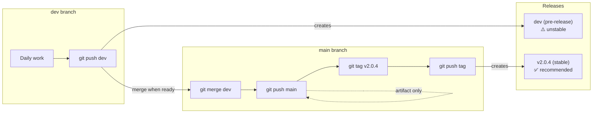

# Developer Workflow Guide

This guide explains the branching, tagging, and release workflow for this project — including if you fork it. The GitHub Actions workflow is included, so your fork will automatically build and release bundles when you push to `dev` or tag a version.

## Branches

| Branch | Purpose |
|--------|---------|
| `dev` | Active development, can be unstable |
| `main` | Stable, tested code ready for release |

## Daily Development (on `dev` branch)

```bash
# You're on dev, making changes
git checkout dev

# Edit files, test locally...

# Commit and push
git add -A && git commit -m "feat: add cool feature"
git push origin dev
```

**What happens automatically:**
- Bundle workflow runs → creates artifact `open_webui_openrouter_pipe_bundled-dev`
- Updates the `dev` pre-release with the new bundle
- Bleeding-edge users can download from the `dev` release

---

## Releasing a New Version

```bash
# 1. Merge dev → main
git checkout main
git pull                              # Get latest main
git merge dev                         # Merge your changes
git push origin main                  # Push to main (no release created)

# 2. Create version tag
git tag v2.0.4                        # Create tag
git push origin v2.0.4                # Push tag
# → This creates the v2.0.4 release automatically!

# 3. Go back to dev for next work
git checkout dev
git merge main                        # Keep dev in sync
```

---

## Visual Flow



---

## What Each Thing Is For

| Concept | Purpose | URL |
|---------|---------|-----|
| **dev branch** | Your working area, can be messy | Updates `dev` pre-release |
| **main branch** | Stable, tested code (staging for tags) | Artifact only |
| **Tags (v2.0.4)** | Permanent version markers | Creates versioned release |
| **dev release** | "Bleeding edge" for adventurous users | `.../download/dev/...` |
| **v2.0.4 release** | Stable version for most users | `.../releases/latest/download/...` |

---

## Quick Reference

```bash
# Daily work
git checkout dev
# ... edit, commit, push ...
git push origin dev                    # → updates "dev" pre-release

# Ready to release
git checkout main && git merge dev && git push    # → artifact only
git tag v2.0.4 && git push origin v2.0.4          # → creates v2.0.4 release
git checkout dev && git merge main                 # → sync dev

# Hotfix on main (rare)
git checkout main
# ... fix bug ...
git push origin main                   # → artifact only
git tag v2.0.5 && git push origin v2.0.5          # → creates v2.0.5 release
git checkout dev && git merge main                 # → sync dev
```

---

## Download URLs

### For Users

```
# Stable (recommended for most users) — auto-resolves to latest tagged release:
https://github.com/rbb-dev/Open-WebUI-OpenRouter-pipe/releases/latest/download/open_webui_openrouter_pipe_bundled.py

# Development build (bleeding edge, may be unstable):
https://github.com/rbb-dev/Open-WebUI-OpenRouter-pipe/releases/download/dev/open_webui_openrouter_pipe_bundled.py
```

### For Developers (Artifacts)

Go to **Actions** → select a workflow run → scroll to **Artifacts** → download the `.zip` file.

---

## Key Insight

**Branches are for work, tags are for releases.**

- Push to `dev` → updates the `dev` pre-release
- Push to `main` → creates artifact only (staging area)
- Push a `v*` tag → creates a new versioned stable release
